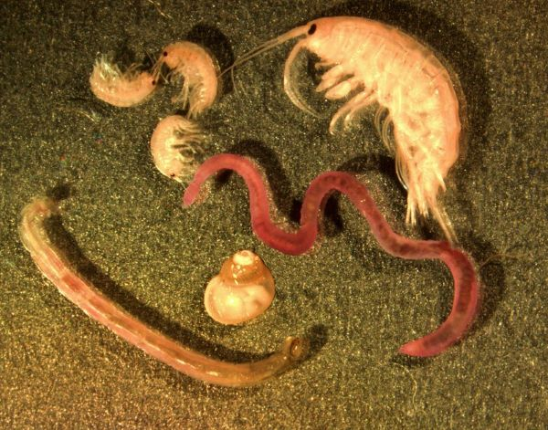

```{r setup, include=FALSE}
knitr::opts_chunk$set(include = F, warning=F, message=F, echo=F)
```


Ecologists are often interested in the effects of perturbations (e.g. fires, logging, flooding or pollution) on biodiversity. 
However, boiling biodiversity down to a single metric can be difficult.
With the help of the Turkey lake dataset of benthic invertebrates [@reference], we will present you with a number of common metrics, their meaning, and how they can be visualized with the help of a Rank-Abundance curves. 
You will then have the option to learn to do it yourself using an R package called codyn.

# The Data

The Turkey Lakes Watershed Study (see map) is an initiative by several agencies of the government of Canada, initially designed to study the effects of acid rain on forest ecosystems.
From 1995 to 2009, scientists collected, identified and counted benthic invertebrates from various stream beds around the Turkey Lakes catchment. 
Benthic invertebrates are small, often microscopic organisms (see Fig. 1), but form an important link between aquatic and terrestrial habitats . 
They can decompose terrestrial matter such as leaves, or consume periphyton growing on rocks within their streams.
Benthic invertebrates can be a food source for aquatic animals, like small fish, or terrestrial animals such as fish.
An experiment was conducted in 1997, where certain sampling sites experienced different levels of logging intensity.
Due to their interaction with the terrestrial realm, we can hypothesize that the biodiversity of benthic invertebrate communities might be affected by logging.




```{r include=T}
library(leaflet)

leaflet() %>%
  addTiles() %>%  # Add default OpenStreetMap map tiles
  addMarkers(lng=-84.4110, lat=47.0515, popup="Turkey Lakes")

```

# Rank Abundance Curve


# Species Richness
                                 
Perhaps the simplest measure of biodiversity is species richness. 
Simply count the number of species with an abundance greater than $0$.

```{r exercise=T, include=T, echo=T}
# Code or exercise on calculating species richness?
```


# Shannon Index


# Evenness Index


# Community Stability


